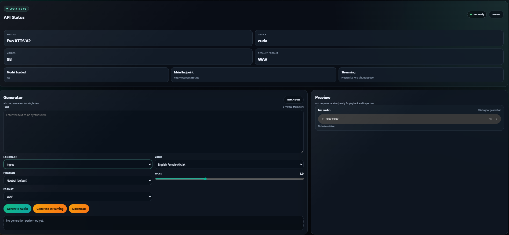

# Evo XTTS V2 for Windows

Local XTTS voice cloning with a browser interface, FastAPI backend, multilingual TTS support, and optional NVIDIA GPU acceleration on Windows.



## Overview

Evo XTTS V2 is designed to run locally on Windows with a simple workflow:

- local web interface at `http://localhost:8881/`
- local FastAPI server at `http://localhost:8881`
- voice cloning from `.wav` reference files
- multilingual input text support
- full audio generation through `/tts`
- progressive audio generation through `/tts/stream`
- CUDA support when a compatible NVIDIA GPU is available
- CPU fallback when needed

## Who This Project Is For

- users who want local speech generation without external services
- people who want a simple browser UI
- developers who want to use the local API from PHP, Python, curl, or automation tools
- maintainers who want to publish a portable Windows release

## Requirements

### Source Usage

- Windows 10 or Windows 11
- Python 3.11
- NVIDIA GPU recommended, but not required
- internet access on first install to download dependencies and the model

### MP3 Support

`ffmpeg` is optional. Without it, the project still works with `WAV` output.

Suggested install:

```powershell
winget install ffmpeg
```

## Quick Source Setup

1. Download or clone the project.
2. Open the project folder.
3. Run `install.bat`.
4. Wait for the environment setup and model download to finish.
5. Place at least one `.wav` file inside `voices/`.
6. Run `start.bat`.
7. Wait for the interface to open in the browser.

## Using The Web Interface

1. Open `http://localhost:8881/`.
2. Enter the text.
3. Choose the language.
4. Choose the voice.
5. Adjust emotion, speed, and format.
6. Click `Generate Audio` for full output or `Generate Streaming` for streaming output.
7. Listen in the preview player and download the result if needed.

## Voices

Every `.wav` file inside `voices/` becomes an available cloned voice in the UI and API.

Examples:

- `voices\narrator.wav`
- `voices\female.wav`
- `voices\male.wav`

Recommended voice sample quality:

- 6 to 30 seconds
- one speaker only
- no background music
- low echo and low noise
- clean and consistent volume

## Supported Languages

The live source of truth is `GET /languages`. In the current codebase, the supported language IDs are:

- `ar` Arabic
- `da` Danish
- `de` German
- `en` English
- `es` Spanish
- `fr` French
- `ja` Japanese
- `nl` Dutch
- `no` Norwegian
- `pt` Portuguese
- `sv` Swedish

Notes:

- send the language code in the `language` field
- the same cloned voice can be used across different languages
- prefer `GET /languages` if you want the current runtime list

## Main Endpoints

- Interface: `http://localhost:8881/`
- Swagger API Docs: `http://localhost:8881/docs`
- Quick Guide: `docs/doc.html`
- Health: `http://localhost:8881/health`
- Voices: `http://localhost:8881/voices`
- Languages: `http://localhost:8881/languages`
- Emotions: `http://localhost:8881/emotions`

## Full API Reference

### `GET /health`

Returns API status information.

Example response:

```json
{
  "status": "ok",
  "engine": "Evo XTTS V2",
  "device": "cuda",
  "model_loaded": true,
  "voices_loaded": 2
}
```

### `GET /voices`

Lists available cloned voices. Each voice corresponds to a `.wav` file inside `voices/`.

Example response:

```json
[
  {
    "id": "male",
    "name": "male",
    "gender": "cloned",
    "lang": "pt",
    "description": "Voice cloned from male.wav",
    "languages": ["ar", "da", "de", "en", "es", "fr", "ja", "nl", "no", "pt", "sv"]
  }
]
```

### `GET /languages`

Lists the accepted `language` codes.

Example response:

```json
[
  { "id": "pt", "name": "Portuguese" },
  { "id": "en", "name": "English" },
  { "id": "es", "name": "Spanish" }
]
```

### `GET /emotions`

Lists accepted backend emotion IDs with descriptions and speed modifiers.

Example response:

```json
[
  {
    "id": "neutral",
    "description": "Default balanced voice for narration",
    "temperature": 0.65,
    "speed_modifier": 1.0
  }
]
```

Note:

- to avoid stale documentation, prefer reading emotion IDs from `GET /emotions`

### `POST /tts`

Generates the complete audio and only returns when finished.

JSON fields:

- `text`: required string, 1 to 10000 characters
- `voice`: optional string, voice ID. If empty, the default available voice is used
- `language`: optional string, default `pt`
- `speed`: optional number between `0.5` and `2.0`, default `1.0`
- `format`: `wav` or `mp3`, default `wav`
- `emotion`: optional string. Use `GET /emotions` to discover valid IDs

Response:

- `audio/wav` when `format = wav`
- `audio/mpeg` when `format = mp3`

Example body:

```json
{
  "text": "Hello world.",
  "voice": "male",
  "language": "en",
  "speed": 1.0,
  "format": "wav",
  "emotion": "neutral"
}
```

### `POST /tts/stream`

Generates streaming audio and sends MP3 chunks as they become available.

JSON fields:

- `text`: required string, 1 to 10000 characters
- `voice`: optional string, voice ID. If empty, the default available voice is used
- `language`: optional string, default `pt`
- `speed`: optional number between `0.5` and `2.0`, default `1.0`
- `emotion`: optional string. Use `GET /emotions` to discover valid IDs

Response:

- always `audio/mpeg`
- does not accept `format`
- ideal for progressive playback or download

## curl Examples

### Check status

```bash
curl http://localhost:8881/health
```

### List voices

```bash
curl http://localhost:8881/voices
```

### List languages

```bash
curl http://localhost:8881/languages
```

### List emotions

```bash
curl http://localhost:8881/emotions
```

### Generate Portuguese TTS as WAV

```bash
curl -X POST http://localhost:8881/tts \
  -H "Content-Type: application/json" \
  -d '{
    "text": "Hello. This is a Portuguese test.",
    "voice": "Portuguese_Brazilian_Male_Andre",
    "language": "pt",
    "speed": 1.0,
    "format": "wav"
  }' \
  --output output_pt.wav
```

### Generate English TTS as MP3

```bash
curl -X POST http://localhost:8881/tts \
  -H "Content-Type: application/json" \
  -d '{
    "text": "Hello. This is a test in English.",
    "voice": "English_Male_DaveL",
    "language": "en",
    "speed": 1.0,
    "format": "mp3"
  }' \
  --output output_en.mp3
```

### Generate Spanish TTS with emotion

```bash
curl -X POST http://localhost:8881/tts \
  -H "Content-Type: application/json" \
  -d '{
    "text": "Hola. Esta es una demostracion en espanol.",
    "voice": "Spanish_Male_CarlosC",
    "language": "es",
    "speed": 1.0,
    "format": "mp3",
    "emotion": "neutral"
  }' \
  --output output_es.mp3
```

### Generate English streaming audio

```bash
curl -X POST http://localhost:8881/tts/stream \
  -H "Content-Type: application/json" \
  -d '{
    "text": "This audio is being generated with streaming.",
    "voice": "English_Male_DaveL",
    "language": "en",
    "speed": 1.0,
    "emotion": "neutral"
  }' \
  --output stream_en.mp3
```

## Python Example

```python
import requests

base_url = "http://localhost:8881"
payload = {
    "text": "Bonjour. Ceci est un test en francais.",
    "voice": "French_Female_GaelleS",
    "language": "fr",
    "speed": 1.0,
    "format": "mp3",
    "emotion": "neutral",
}

response = requests.post(f"{base_url}/tts", json=payload, timeout=300)
response.raise_for_status()

with open("example_fr.mp3", "wb") as f:
    f.write(response.content)
```

Python streaming example:

```python
import requests

base_url = "http://localhost:8881"
payload = {
    "text": "Hallo. Dies ist ein Streaming-Test auf Deutsch.",
    "voice": "German_Male_AndreasHa",
    "language": "de",
    "speed": 1.0,
    "emotion": "neutral",
}

with requests.post(f"{base_url}/tts/stream", json=payload, stream=True, timeout=300) as response:
    response.raise_for_status()
    with open("stream_de.mp3", "wb") as f:
        for chunk in response.iter_content(chunk_size=8192):
            if chunk:
                f.write(chunk)
```

## PHP Example

A complete PHP API example is available in [examples/api.php](examples/api.php).

Minimal example:

```php
<?php
$payload = [
    'text' => 'Hello from PHP.',
    'voice' => 'English_Male_DaveL',
    'language' => 'en',
    'speed' => 1.0,
    'format' => 'mp3',
    'emotion' => 'neutral',
];

$ch = curl_init('http://localhost:8881/tts');
curl_setopt_array($ch, [
    CURLOPT_POST => true,
    CURLOPT_POSTFIELDS => json_encode($payload),
    CURLOPT_HTTPHEADER => ['Content-Type: application/json'],
    CURLOPT_RETURNTRANSFER => true,
    CURLOPT_TIMEOUT => 300,
]);

$audio = curl_exec($ch);
$httpCode = curl_getinfo($ch, CURLINFO_HTTP_CODE);
curl_close($ch);

if ($httpCode !== 200 || $audio === false) {
    throw new RuntimeException('Audio generation failed');
}

file_put_contents(__DIR__ . '/php_en.mp3', $audio);
```

## Formats

- `WAV`: default and recommended for final audio quality
- `MP3`: optional, depends on `ffmpeg`
- `/tts/stream`: always returns `MP3`

## Limits And Behavior

- maximum text length: `10000` characters
- accepted speed range: `0.5` to `2.0`
- if `voice` is empty, the API tries to use the default available voice
- if the voice does not exist, the API returns `400`
- if the language is unsupported, the API returns `400`
- if there are no voices inside `voices/`, `GET /voices` returns `404`

## Main Project Files

- `install.bat`: source setup entry point
- `start.bat`: source launch entry point
- `system/setup.bat`: environment setup
- `system/run-xtts.bat`: API startup
- `system/build-portable.bat`: portable package build script
- `tools/build_portable.py`: portable package builder
- `ui/index.html`: web interface
- `voices/`: voice sample folder
- `examples/`: API examples
- `docs/`: supplemental documentation

## Publishing A Portable Release

Recommended workflow:

1. Run `install.bat`.
2. Run `start.bat`.
3. Confirm the model loads and the interface generates audio.
4. Close the application.
5. Run `system/build-portable.bat`.
6. Take the folder `dist/Evo-XTTS-V2-Windows-Portable`.
7. Compress it as a `.zip` file.
8. Upload that `.zip` file to GitHub Releases.

## What The Portable Release Already Includes

- bundled Python runtime
- application files
- web interface
- local model cache in `.tts`
- empty `voices/` folder for end-user voice samples

## Quick Troubleshooting

### The Browser Opens But The Interface Does Not Respond

Use `Ctrl+F5` to hard refresh the page.

### No Voices Appear

Make sure there is at least one `.wav` file inside `voices/`.

### The API Does Not Start

Run `install.bat` again and then run `start.bat`.

### The GPU Is Not Recognized

Check whether `nvidia-smi` works on Windows. If CUDA is unavailable, the project can fall back to CPU mode.

### MP3 Does Not Work

Install `ffmpeg`.

## Additional Documentation

- [Quick Guide](docs/doc.html)
- [Windows Installation](docs/INSTALL-WINDOWS.md)
- [GitHub Publishing](docs/GITHUB-PUBLISH.md)
- [Troubleshooting](docs/TROUBLESHOOTING.md)
- [GitHub Checklist](docs/CHECKLIST-GITHUB.md)
- [Repository Description Draft](docs/GITHUB-REPO-DESCRIPTION.md)
- [First Release Draft](docs/GITHUB-FIRST-RELEASE.md)

## Contribution Policy

This project is under restricted maintenance by the repository owner.

- external contributions are not open at this time
- the repository owner is responsible for maintenance and releases
- see [CONTRIBUTING.md](CONTRIBUTING.md) for details

## Author

- Marks Junior