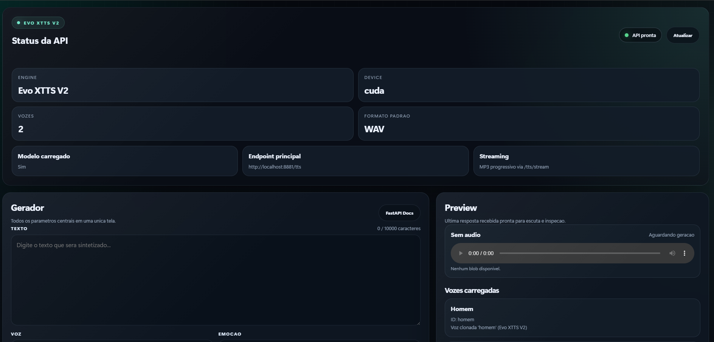
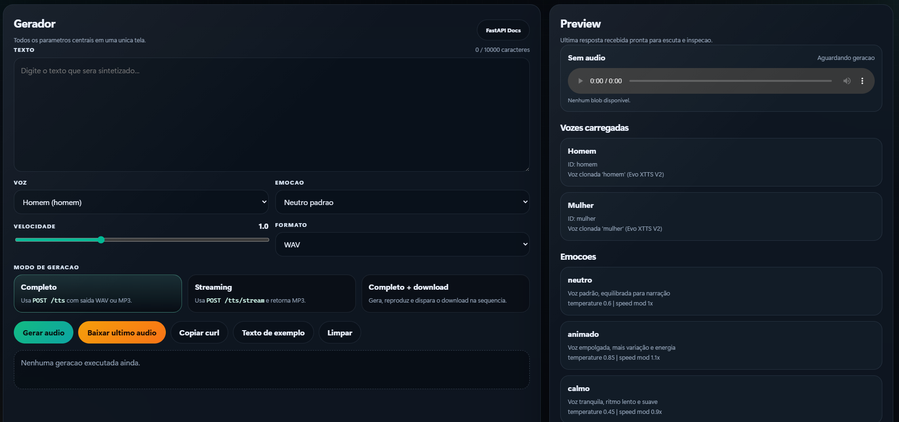

# Evo XTTS V2 para Windows

Interface local de Text-to-Speech em portugues do Brasil com clonagem de voz, painel web, API FastAPI e suporte a GPU NVIDIA no Windows.





## O que e o projeto

Evo XTTS V2 foi preparado para rodar localmente no Windows com foco em uso simples:

- interface web pronta para usuario comum
- API local em `http://localhost:8881`
- suporte a clonagem de voz via arquivos `.wav`
- uso de CUDA quando houver GPU NVIDIA compativel
- fallback para CPU quando necessario
- empacotamento portable para distribuicao em GitHub Releases

## Para quem este projeto foi feito

- usuarios que querem gerar audio localmente sem depender de servico externo
- quem precisa de uma interface simples no navegador
- quem quer usar a API local em PHP, scripts ou automacoes
- quem pretende publicar uma versao portable para usuario leigo no Windows

## Requisitos

### Para usar pelo codigo-fonte

- Windows 10 ou Windows 11
- Python 3.11
- GPU NVIDIA recomendada, mas nao obrigatoria
- conexao com internet na primeira instalacao para baixar dependencias e o modelo

### Para MP3

`ffmpeg` e opcional. Sem ele, o projeto continua funcionando normalmente com `WAV`.

Instalacao sugerida:

```powershell
winget install ffmpeg
```

## Instalacao rapida pelo codigo-fonte

1. Baixe ou clone o projeto.
2. Abra a pasta do projeto.
3. Clique em `Instalar XTTS.bat`.
4. Aguarde a instalacao do ambiente e o download do modelo.
5. Coloque ao menos um arquivo `.wav` dentro da pasta `voices`.
6. Clique em `Abrir XTTS.bat`.
7. Aguarde a interface abrir no navegador.

## Instalacao ideal para usuario comum

Para usuario leigo, o recomendado nao e distribuir o codigo-fonte.
O recomendado e publicar uma **Release portable** no GitHub.

Fluxo ideal do usuario final:

1. Baixar o `.zip` da Release
2. Extrair a pasta
3. Colocar um `.wav` dentro de `voices`
4. Clicar em `Abrir XTTS.bat`
5. Usar no navegador

## Como usar

1. Abra a interface em `http://localhost:8881/`
2. Digite o texto
3. Escolha a voz
4. Ajuste velocidade, emocao e formato
5. Clique em `Gerar audio`
6. Ou?a no preview e baixe o resultado

## Vozes

Cada arquivo `.wav` na pasta `voices` vira uma voz disponivel na interface.

Exemplos:

- `voices\homem.wav`
- `voices\mulher.wav`
- `voices\narrador.wav`

Recomendacao para melhor qualidade:

- 6 a 30 segundos
- uma pessoa so falando
- sem musica ao fundo
- sem eco forte
- audio limpo e com volume consistente

## Formatos

- `WAV`: formato padrao e mais recomendado
- `MP3`: opcional, depende de `ffmpeg`

## Enderecos principais

- Interface: `http://localhost:8881/`
- API Docs: `http://localhost:8881/docs`
- Health check: `http://localhost:8881/health`

## Estrutura principal

- `Instalar XTTS.bat`: instalacao simplificada para codigo-fonte
- `Abrir XTTS.bat`: abre a aplicacao
- `system/setup.bat`: setup do ambiente
- `system/run-xtts.bat`: inicializacao da API
- `system/build-portable.bat`: gera a versao portable
- `tools/build_portable.py`: empacota a release
- `ui/index.html`: interface web
- `voices/`: pasta das vozes
- `docs/`: documentacao complementar
- `examples/`: exemplos de uso da API

## Publicacao no GitHub

Passo a passo recomendado:

1. Execute `Instalar XTTS.bat`
2. Execute `Abrir XTTS.bat`
3. Confirme que o modelo carrega e que a interface gera audio
4. Feche a aplicacao
5. Execute `system/build-portable.bat`
6. Pegue a pasta `dist/Evo-XTTS-V2-Windows-Portable`
7. Compacte em `.zip`
8. Envie esse `.zip` para GitHub Releases

## O que a release portable ja inclui

- runtime Python
- aplicacao pronta
- interface web
- cache local do modelo em `.tts`
- pasta `voices` vazia para o usuario adicionar a propria voz

## O que nao deve ir para o repositorio

- `venv/`
- `.tts/`
- `dist/`
- arquivos privados `.wav` em `voices/`
- audios gerados de teste
- arquivos temporarios locais

## Troubleshooting rapido

### O navegador abre mas a interface nao responde

Use `Ctrl+F5` para recarregar sem cache.

### Nenhuma voz aparece

Confirme se existe ao menos um arquivo `.wav` dentro de `voices`.

### A API nao sobe

Rode `Instalar XTTS.bat` novamente e depois `Abrir XTTS.bat`.

### A GPU nao e reconhecida

Verifique se `nvidia-smi` funciona no Windows. Se nao houver CUDA disponivel, o projeto pode cair para CPU.

### MP3 nao funciona

Instale `ffmpeg`.

## Documentacao adicional

- [Instalacao no Windows](docs/INSTALL-WINDOWS.md)
- [Publicacao no GitHub](docs/GITHUB-PUBLISH.md)
- [Troubleshooting](docs/TROUBLESHOOTING.md)
- [Checklist GitHub](docs/CHECKLIST-GITHUB.md)
- [Descricao pronta do repositorio](docs/GITHUB-REPO-DESCRIPTION.md)
- [Texto pronto da primeira release](docs/GITHUB-FIRST-RELEASE.md)

## Politica de contribuicao

Este projeto esta em manutencao restrita ao autor do repositorio.

- contribuicoes externas nao estao abertas neste momento
- o responsavel pela manutencao e publicacao e o autor do repositorio
- detalhes em [CONTRIBUTING.md](CONTRIBUTING.md)

## Autor

- Marks Junior
